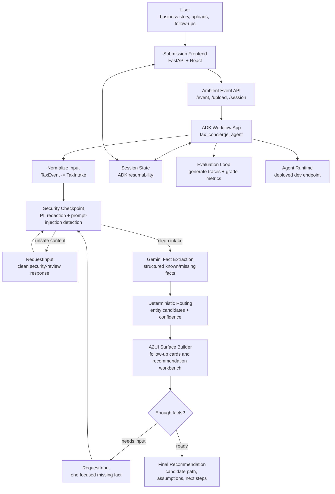

# Tax Concierge Agent

Tax Concierge Agent is an ADK workflow that helps small business owners describe their business situation, answer focused follow-up questions, and receive a careful business tax entity routing recommendation. The project is built for Kaggle's 5-Day AI Agents capstone: it demonstrates agent reasoning, tool-like workflow steps, human-in-the-loop resumability, dynamic UI generation, safety controls, and evaluation.

The user experience is intentionally not a chatbot transcript. The agent emits A2UI messages that the frontend renders as guided intake cards, security review cards, and recommendation surfaces.

## What It Does

- Turns plain-language business tax stories into structured intake state.
- Redacts sensitive identifiers before model reasoning.
- Detects prompt-injection attempts and routes them to a clean-input review step.
- Uses Gemini for fact extraction and explanation, then deterministic routing for entity candidates.
- Pauses with ADK `RequestInput` when it needs one more fact.
- Emits A2UI `createSurface`, `updateDataModel`, and `updateComponents` messages for dynamic frontend rendering.
- Supports ambient event ingestion for user stories, document-upload events, and follow-up responses.
- Includes eval cases for routing correctness, security containment, and interview quality.

## Repository Layout

```text
.
|-- app/                         # agents-cli compatibility entrypoints
|-- tax_concierge_agent/         # ADK workflow, routing, security, service, models
|-- submission_frontend/         # FastAPI + React public demo frontend
|-- tests/
|   |-- eval/                    # behavioral eval dataset and graders
|   |-- integration/             # service and runtime integration tests
|   |-- security/                # local secret/PII scanner fixtures
|   `-- unit/                    # deterministic unit tests
|-- deployment/                  # Terraform generated by agents-cli
|-- resources/                   # course PDFs and reference materials
|-- DESIGN.md                    # product design system
|-- PRODUCT.md                   # product strategy and UX principles
|-- threat_model.md              # STRIDE threat model
`-- agents-cli-manifest.yaml     # agents-cli project metadata
```

## Architecture



## Requirements

- Python 3.11 or newer
- `uv`
- `agents-cli`
- Google API credentials for Gemini/ADK runtime calls
- Google Cloud SDK for deployment workflows

Install the agents CLI once:

```bash
uv tool install google-agents-cli
```

Install project dependencies:

```bash
agents-cli install
```

Create a local `.env` from the example:

```bash
cp .env.example .env
```

Then set the relevant values:

```text
GOOGLE_GENAI_USE_VERTEXAI=0
GOOGLE_API_KEY=your_google_ai_studio_api_key_here
GOOGLE_CLOUD_PROJECT=your-project-id
GOOGLE_CLOUD_LOCATION=us-east1
```

Do not commit real secrets.

## Run Locally

Run the ADK playground:

```bash
agents-cli playground
```

Run the ambient FastAPI service:

```bash
make service
```

The service exposes:

- `GET /health`
- `POST /event`
- `POST /upload`
- `GET /session/{session_id}`

Run the submission frontend service from its own package:

```bash
cd submission_frontend
cd frontend
npm install
npm run build
cd ..
uv run uvicorn main:app --host 127.0.0.1 --port 8080
```

The frontend can use a deployed Agent Runtime when `GCP_PROJECT`, `GCP_LOCATION`, and `AGENT_RUNTIME_ID` are configured, and otherwise falls back to local behavior for the demo surface.

## Common Commands

| Command | Purpose |
| --- | --- |
| `agents-cli install` | Install Python dependencies with `uv`. |
| `agents-cli playground` | Start the local ADK playground. |
| `make service` | Run the ambient FastAPI service on `127.0.0.1:8080`. |
| `make eval-local` | Generate local traces and grade them with local judges. |
| `agents-cli eval generate` | Run behavioral eval generation through agents-cli. |
| `agents-cli eval grade` | Grade generated traces with configured metrics. |
| `agents-cli lint` | Run agents-cli lint checks. |
| `uv run pytest tests/unit tests/integration` | Run deterministic unit and integration tests. |

## Evaluation

The capstone emphasizes more than a working prototype, so this repo includes an evaluation loop under `tests/eval/`.

Current metrics:

- `routing_correctness`: entity candidates are reasonable and not overconfident.
- `security_containment`: PII is redacted and malicious sessions are quarantined.
- `interview_quality`: follow-up questions are understandable and focused.

Run the local eval loop:

```bash
make eval-local
```

Run the standard agents-cli flow:

```bash
agents-cli eval generate
agents-cli eval grade
```

## Safety Model

Tax Concierge handles sensitive personal and business context, so safety is part of the core workflow rather than a later UI concern.

- `tax_concierge_agent/security.py` redacts SSNs, EINs, account numbers, card numbers, dates of birth, emails, phone numbers, and street addresses.
- Prompt-injection patterns such as "ignore previous instructions" and "bypass tax rules" are quarantined before model reasoning.
- Uploaded document text is treated as untrusted observation data.
- Ambiguous or incomplete facts produce a `RequestInput` pause instead of a premature recommendation.
- The STRIDE analysis is documented in `threat_model.md`.

## Deployment

This project was scaffolded with `agents-cli` for `agent_runtime` deployment. The manifest is in `agents-cli-manifest.yaml`.

Deploy only after explicit human approval:

```bash
gcloud config set project <your-project-id>
agents-cli deploy
```

The last recorded dev deployment metadata is stored in `deployment_metadata.json`.

## Capstone Submission Notes

This README is the technical setup guide. Linked below, the Kaggle Writeup, media gallery, video, and public project link should carry the broader project narrative, demo walkthrough, and judging-track positioning.
https://www.kaggle.com/competitions/vibecoding-agents-capstone-project/writeups/tax-concierge-agent
