# tax-concierge-agent

Simple ReAct agent
Agent generated with `agents-cli` version `0.5.0`

## Project Structure

```
tax-concierge-agent/
├── app/         # Core agent code
│   ├── agent.py               # Main agent logic
│   └── app_utils/             # App utilities and helpers
├── tests/                     # Unit, integration, and load tests
├── GEMINI.md                  # AI-assisted development guide
└── pyproject.toml             # Project dependencies
```

## Architecture

```mermaid
flowchart LR
    subgraph Ingestion["1. Event Ingestion"]
        IntakeEvents["Tax intake frontend events"]
        UploadEvents["Document upload events"]
        Topic["Pub/Sub topic<br/>tax-intake-events"]
        PushSub["Push subscription<br/>tax-intake-events-push<br/>OIDC + no wrapper"]
        DeadLetter["Dead-letter topic<br/>tax-intake-events-dead-letter"]

        IntakeEvents --> Topic
        UploadEvents --> Topic
        Topic --> PushSub
        PushSub -. "failed delivery after retries" .-> DeadLetter
    end

    subgraph Frontend["2. Tax Concierge Frontend"]
        CloudRun["submission_frontend<br/>Cloud Run"]
        IntakePage["Come-as-you-are intake page"]
        ReviewCards["Dynamic A2UI review cards"]
        UploadReview["Document upload and review"]
        ResumeSessions["Resume RequestInput sessions"]

        CloudRun --> IntakePage
        CloudRun --> ReviewCards
        CloudRun --> UploadReview
        CloudRun --> ResumeSessions
    end

    subgraph Runtime["3. Agent Runtime"]
        AgentRuntime["Tax Concierge ADK graph workflow"]
        Security["SecurityCheckpoint"]
        Understanding["Story Understanding"]
        Reasoner["Entity Reasoner"]
        MissingFacts["Missing Facts Detector"]
        A2UI["Dynamic A2UI Planner"]
        HITL["RequestInput human-in-the-loop pause"]
        Recommendation["Final Recommendation"]

        AgentRuntime --> Security
        Security --> Understanding
        Understanding --> Reasoner
        Reasoner --> MissingFacts
        MissingFacts --> A2UI
        A2UI --> HITL
        HITL --> AgentRuntime
        MissingFacts --> Recommendation
    end

    subgraph Documents["4. Document Understanding"]
        Runpod["Runpod Flash endpoint<br/>(optional)"]
        Qwen["Qwen VLM document extraction"]
        LowConfidence["Low-confidence fields"]
        DocReview["A2UI document review cards"]

        Runpod --> Qwen
        Qwen --> LowConfidence
        LowConfidence --> DocReview
    end

    subgraph State["5. Session State"]
        Sessions["Agent Platform Session Service"]
    end

    PushSub -->|"POST :query"| AgentRuntime
    CloudRun -->|"query sessions + submit intake"| AgentRuntime
    ResumeSessions -->|"function_response resume"| HITL
    UploadReview --> Runpod
    DocReview --> ReviewCards
    ReviewCards --> CloudRun
    AgentRuntime <--> Sessions
    HITL <--> Sessions
    Recommendation --> CloudRun
```



The architecture supports ambient events by letting frontend and document-upload producers publish normalized tax intake events to `tax-intake-events`, where an authenticated push subscription can invoke the Agent Runtime workflow directly. The ADK graph uses `RequestInput` pauses for human-in-the-loop review, while the Cloud Run frontend resumes those sessions and renders generated A2UI cards instead of chatbot transcripts. Sensitive taxpayer details are redacted in the security checkpoint before model reasoning, and optional document understanding routes low-confidence extracted fields into editable A2UI review cards rather than exposing raw OCR text.

> 💡 **Tip:** Use [Gemini CLI](https://github.com/google-gemini/gemini-cli) for AI-assisted development - project context is pre-configured in `GEMINI.md`.

## Requirements

Before you begin, ensure you have:
- **uv**: Python package manager (used for all dependency management in this project) - [Install](https://docs.astral.sh/uv/getting-started/installation/) ([add packages](https://docs.astral.sh/uv/concepts/dependencies/) with `uv add <package>`)
- **agents-cli**: Agents CLI - Install with `uv tool install google-agents-cli`
- **Google Cloud SDK**: For GCP services - [Install](https://cloud.google.com/sdk/docs/install)


## Quick Start

Install `agents-cli` and its skills if not already installed:

```bash
uvx google-agents-cli setup
```

Install required packages:

```bash
agents-cli install
```

Test the agent with a local web server:

```bash
agents-cli playground
```

You can also use features from the [ADK](https://adk.dev/) CLI with `uv run adk`.

## Commands

| Command              | Description                                                                                 |
| -------------------- | ------------------------------------------------------------------------------------------- |
| `agents-cli install` | Install dependencies using uv                                                         |
| `agents-cli playground` | Launch local development environment                                                  |
| `agents-cli lint`    | Run code quality checks                                                               |
| `agents-cli eval`    | Evaluate agent behavior (generate, grade, analyze, and more — see `agents-cli eval --help`) |
| `uv run pytest tests/unit tests/integration` | Run unit and integration tests                                                        |

## 🛠️ Project Management

| Command | What It Does |
|---------|--------------|
| `agents-cli scaffold enhance` | Add CI/CD pipelines and Terraform infrastructure |
| `agents-cli infra cicd` | One-command setup of entire CI/CD pipeline + infrastructure |
| `agents-cli scaffold upgrade` | Auto-upgrade to latest version while preserving customizations |

---

## Development

Edit your agent logic in `app/agent.py` and test with `agents-cli playground` - it auto-reloads on save.

## Deployment

```bash
gcloud config set project <your-project-id>
agents-cli deploy
```

To add CI/CD and Terraform, run `agents-cli scaffold enhance`.
To set up your production infrastructure, run `agents-cli infra cicd`.

## Observability

Built-in telemetry exports to Cloud Trace, BigQuery, and Cloud Logging.
